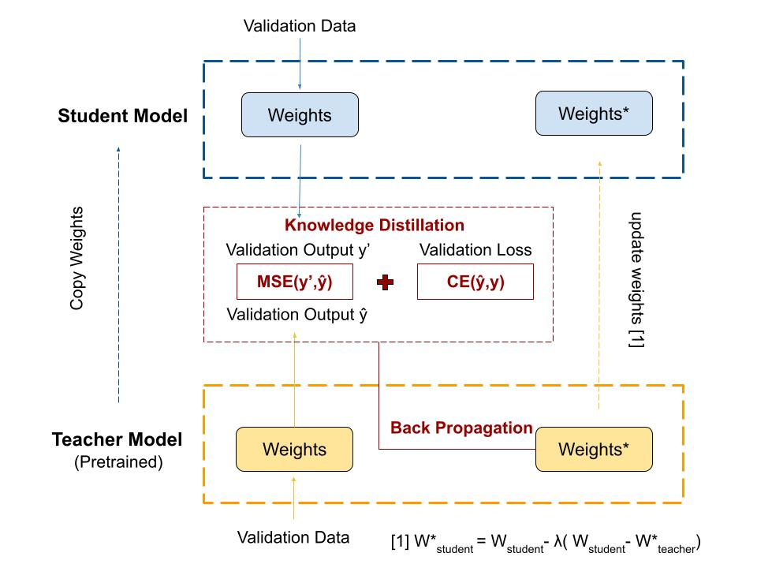

# Meta-KD
Meta Learning by Knowledge Distillation 
Objective: 
* improve teacher model's performance by leveraging knowledge distillation (primary goal)
(if we have time)
* improve student model's performance 
* reduce params of student model 

## Algorithm

## Implementation Referencing
1. lonePatient(2020)[Souce Code](https://github.com/lonePatient/MobileBert_PyTorch)

## Data
[SST-2](https://gluebenchmark.com/tasks)
    - train.tsv
    - dev.tsv
    - test.tsv

## How to run code
1. Create folder for model and output under ./Meta-KD
<pre>
mkdir outputs
mkdir bert_base_uncased
</pre>
2. 
Download pre-trained [BERT Model](https://huggingface.co/bert-base-uncased) to "./bert_base_uncased" folder. Including following three files:
<pre>
- pytorch_model.bin
- config.json
- vocab.txt
</pre>

3. Run .sh file for training or evaluation:

**Note** Change the CURRENT_DIR inside .sh files to "./Meta-KD" before running.
* To run classifiers(training) with knwoledge distillation: 
<pre>
sh run_classifier.sh
</pre>
* To run evalulation with knowledge distillation: 
<pre>   
sh run_classifier_eval.sh
</pre>
* To run classifiers(training) without knwoledge distillation: 
<pre>
sh run_classifier_no_kd.sh
</pre>
* To run evalulation without knowledge distillation: 
<pre>   
sh run_classifier_no_kd_eval.sh
</pre>